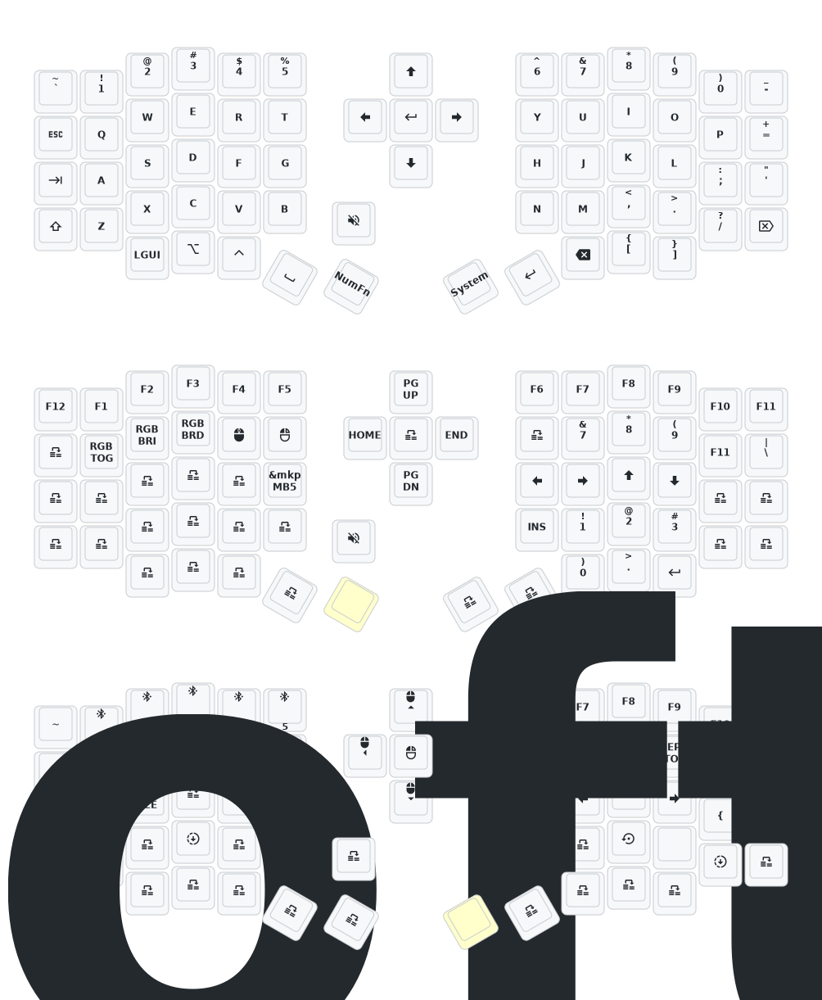

***This is the firmware for those with the dongle***

Fork of the ZMK Eyelash firmware most aliexpress sellers use, just with my own keymap. Feel free to grab if you want my layout for some reason - pictured below.

If you want to flash it, grab the firmware files from the latest build in the "Actions" tab. For each side and the dongle, plug the device into USB and double tap the button on the back of the board. You should have a USB drive that is the keyboard connect. For all, copy over the "settings_reset" file - once it loads the USB drive will go away. Double tap the button again.
For the left side, paste in "eyelash_sofle_peripheral_left nice_view_battery-nice_nano_v2-zmk.uf2". For the right, paste in "eyelash_sofle_peripheral_right nice_view_battery-nice_nano_v2-zmk.uf2". For the dongle, paste in "eyelash_sofle_central_dongle_oled.uf2".

If you flash your device you do so at your own risk. Make sure you have backup firmware in case this is not compatible with your board. 

# Sofle Keymap

